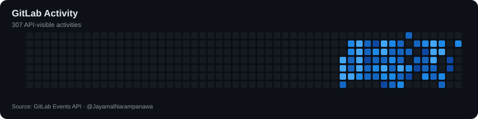
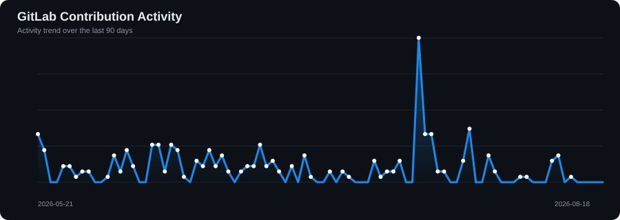

<!-- ========================================================= -->

<!--                 JAYAMAL NARAMPANAWA                       -->

<!--              FUTURISTIC GITHUB PROFILE                    -->

<!-- ========================================================= -->

<!-- ==================== HERO BANNER ==================== -->

  

  

  

  
  
  
  

---

<!-- ==================== ABOUT ME ==================== -->

<h1 align="center">👋 About Me</h1>

  <b>Software Engineering Undergraduate • Web Developer • AI & IoT Builder • UI/UX Enthusiast </b>

  I'm <b>Jayamal Narampanawa</b>, a Software Engineering student from Sri Lanka passionate about building
  intelligent, visually striking, and meaningful digital products.
    
  My work spans <b>frontend engineering</b>, <b>full-stack development</b>,
  <b>mobile applications</b>, <b>AI/ML</b>, <b>IoT systems</b>,
  <b>GIS</b>, and <b>modern UI/UX design</b>.
    
  I love transforming ambitious ideas into real-world systems —
  from AI-powered agriculture platforms and disaster intelligence systems
  to social platforms, intelligent dashboards, and immersive digital experiences.

  🔭 Building intelligent software with real-world impact
   
  🌱 Exploring AI, Machine Learning, GIS, IoT & intelligent systems
   
  🎨 Passionate about futuristic, minimalist and immersive UI/UX
   
  💻 Working across GitHub and GitLab ecosystems
   
  🎵 Musical artist, vocalist and technology enthusiast
   
  ⚡ Always learning. Always building. Always evolving.

  

---

<!-- ==================== TECH STACK ==================== -->

<h2 align="center">⚡ Technology Arsenal</h2>

  <i>Languages • Frameworks • Platforms • Tools</i>

  

  

  
  

  
  
  

  
  
  

---

<!-- ==================== CURRENT MISSION ==================== -->

<h2 align="center">🧠 Current Mission</h2>

  

  🚜 <b>AgroSmart 2.0</b> — AI-Powered Smart Agriculture Intelligence Platform
    
  🛰️ <b>ReBorn Sentinel</b> — AI-Powered Landslide Risk Intelligence & Early Warning Platform
    
  🌐 <b>ImpactEcho</b> — The Volunteer Social Hub

---

<!-- ==================== FEATURED PROJECTS ==================== -->

<h2 align="center">🚀 Featured Engineering Projects</h2>

 

<table align="center">

<tr>

<td width="50%" valign="top">

<h3 align="center">🌱 AgroSmart 2.0</h3>

 AI-powered precision agriculture platform combining IoT monitoring, machine learning, explainable AI, SCADA, Digital Twin technology, AR visualization and intelligent crop recommendations. 

 <b>React • Firebase • Python • ML • IoT • ESP32 • Flutter • TensorFlow</b> 

</td>

<td width="50%" valign="top">

<h3 align="center">🛰️ ReBorn Sentinel</h3>

 AI-powered landslide risk intelligence and early warning platform for Sri Lanka integrating weather, GIS, terrain, satellite and geological intelligence. 

 <b>Next.js • GIS • AI/ML • PostgreSQL • Python • XAI</b> 

</td>

</tr>

<tr>

<td width="50%" valign="top">

<h3 align="center">💼 Remote Job Optimizer</h3>

 A modern web application designed to help optimize the remote job search experience and improve the process of discovering and managing relevant remote job opportunities. 

 <b>React • Node.js • Express • Full-Stack Development</b> 

</td>

<td width="50%" valign="top">

<h3 align="center">🚚 RouteXpress</h3>

 Delivery route planning and order management platform implementing Dijkstra shortest-path routing, queues, stacks, searching and sorting algorithms. 

 <b>React • Node.js • MongoDB • Algorithms • Maps</b> 

</td>

</tr>

</table>

 

  

<!-- ==================== DEVELOPMENT ECOSYSTEM ==================== -->

<h2 align="center">🌐 My Development Ecosystem</h2>

  Building and collaborating across both <b>GitHub</b> and <b>GitLab</b>.

  
  

---

<!-- ==================== GITHUB TROPHIES ==================== -->

<h2 align="center">🏆 GitHub Achievements</h2>

  

---

<!-- ==================== GITHUB STATS ==================== -->

<h2 align="center">📊 GitHub Intelligence Center</h2>

  

<table align="center">
  <tr>
    <td align="center" width="50%">
      
    </td>
    <td align="center" width="50%">
      
    </td>
  </tr>
</table>

---

<!-- ==================== CONTRIBUTION MATRIX ==================== -->

<h1 align="center">📊 Contribution Matrix</h1>

  <b>🟢 GitHub Contributions</b>
  &nbsp;&nbsp;&nbsp;•&nbsp;&nbsp;&nbsp;
  <b>🔵 GitLab Contributions</b>

<h2 align="center">🟢 GitHub Contribution Graph</h2>

  

  
    Contribution activity across repositories, commits, pull requests and development activity on GitHub.
  

 

<h2 align="center">🔵 GitLab Contribution Graph</h2>

  

  
    API-visible GitLab activity generated automatically from
    <a href="https://gitlab.com/JayamalNarampanawa">@JayamalNarampanawa</a>
  

---

<!-- ==================== ACTIVITY GRAPHS ==================== -->

<h1 align="center">⚡ Development Activity Timeline</h1>

<h2 align="center">🟢 GitHub Activity Graph</h2>

  

 

<h2 align="center">🔵 GitLab Activity Graph</h2>

  

  🟢 <b>GitHub</b> — Public & eligible repository contribution activity
   
  🔵 <b>GitLab</b> — API-visible development activity

---

<!-- ==================== DEVELOPER ANALYTICS ==================== -->

<h2 align="center">🧬 Developer Analytics</h2>

  <i>A deeper look into my GitHub development ecosystem</i>

<table align="center">
  <tr>
    <td align="center" width="50%">
      
    </td>
    <td align="center" width="50%">
      
    </td>
  </tr>

  <tr>
    <td align="center" width="50%">
      
    </td>
    <td align="center" width="50%">
      
    </td>
  </tr>
</table>

---

<!-- ==================== CREATIVE SIDE ==================== -->

<h2 align="center">🎵 Beyond The Code</h2>

  When I'm not building software, I'm exploring another world of creativity —
  <b>music</b>.
    
  I'm a musical artist and vocalist who believes technology and art share
  the same foundation:
    
  <b>Creativity. Emotion. Innovation.</b>

  

---

<!-- ==================== CONNECT ==================== -->

<h2 align="center">🌐 Let's Connect</h2>

  <i>Let's connect, collaborate and build something extraordinary.</i>

  
  
  
  
  
  

  &nbsp;&nbsp;&nbsp;
  &nbsp;&nbsp;&nbsp;
  &nbsp;&nbsp;&nbsp;
  &nbsp;&nbsp;&nbsp;
  

---

<!-- ==================== SUPPORT ==================== -->

<h2 align="center">💛 Support My Journey</h2>

  

---

<!-- ==================== DEV QUOTE ==================== -->

<h2 align="center">💭 Developer Mindset</h2>

  

---

<!-- ==================== FINAL MESSAGE ==================== -->

  

<h2 align="center">
  ⚡ Code with Purpose. Design with Heart. Build for the Future. ⚡
</h2>

  <b>✨ Thanks for visiting my digital universe.</b>
   
  Stay curious. Keep building. Never stop creating.

  

